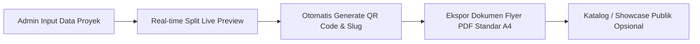

# STAS RG - Project Flyer Generator

<p align="center">
  
  &nbsp;&nbsp;&nbsp;&nbsp;
  
</p>

<p align="center">
  <strong>Alat Otomasi Pembuatan Flyer Riset & Inovasi Proyek Terstandarisasi</strong><br>
  <em>Center of Excellence Sustainable Technology and Applied Sciences Research Group (CoE STAS-RG) – Telkom University</em>
</p>

<p align="center">
  
  
  
  
  
  
</p>

---

## 📌 Tentang Aplikasi (About The Generator)

**STAS RG Flyer Generator** adalah *internal tool* berbasis web yang dirancang khusus untuk mempermudah **Admin / Pengelola Lab CoE STAS-RG** dalam membuat lembar publikasi (**Flyer Riset A4**) secara otomatis dan konsisten.

Dengan aplikasi ini, admin **tidak perlu mendesain manual dari nol** di Canva, Photoshop, atau Figma. Cukup masukkan data riset (judul, gambar utama, poin latar belakang & solusi, spesifikasi teknis, logo mitra, dan tautan), sistem akan langsung menyusun layout terstandarisasi, membuat **QR Code otomatis**, dan menghasilkan dokumen **Flyer PDF siap cetak** dalam hitungan detik.

---

## 🎯 Fokus & Alur Kerja Utama



1. **Input Data Cepat**: Form terstruktur untuk memasukkan data proyek inovasi riset.
2. **Real-time Live Preview**: Tampilan *split screen* yang langsung mencerminkan hasil flyer secara instan saat data diketik.
3. **Automated QR Code Generator**: Otomatis menghasilkan QR Code yang mengarah ke tautan proyek/demo riset.
4. **Instant PDF Export**: Sekali klik untuk mengunduh dokumen flyer PDF beresolusi tinggi dengan tata letak resmi CoE STAS-RG.
5. **Katalog Proyek Terbit**: Halaman showcase ringkas bagi publik atau mitra yang ingin melihat arsip flyer riset yang sudah dipublikasikan.

---

## ✨ Fitur Utama (Core Features)

### 1. 🖨️ Automated Flyer Generator & PDF Engine
- **Template Standar A4 Resmi CoE STAS-RG**: Layout satu halaman yang presisi, rapi, dan siap cetak untuk pameran, expo, atau arsip lab.
- **Split Screen Live Preview**: Memantau tampilan flyer secara *real-time* sebelum diekspor ke PDF.
- **Automated QR Code Embedding**: QR Code dinamis langsung terpasang di dalam dokumen PDF flyer.
- **Media & Logo Uploader**: Unggah foto produk/riset, logo mitra kerjasama, dan logo footer secara instan.
- **One-Click Project Clone**: Duplikasi data flyer sebelumnya untuk membuat variasi flyer baru tanpa input ulang dari awal.

### 2. 🔐 Akses Khusus Admin & Keamanan
- **Autentikasi Aman**: Login Email & Password, Google OAuth 2.0 SSO, dan **Biometric Passkey** (Fingerprint / Windows Hello).
- **Admin Approval System**: Pendaftaran akun admin baru melalui alur persetujuan (*Pending $\rightarrow$ Approved*) untuk menjaga keamanan akses internal.
- **Pemulihan Akun via OTP Email**: Reset password menggunakan 6-digit OTP terverifikasi.

### 3. 🎨 Contemporary Clean UI (Zero Shadows)
- **Minimalist & Clean SaaS UI**: Menggunakan desain modern tanpa bayangan (*Strict Zero Shadows*), border halus, dan aksen warna hijau emerald khas CoE STAS-RG.
- **Dark Mode & Light Mode**: Dukungan tema gelap dan terang dengan deteksi sistem otomatis.
- **Dukungan Multi-Bahasa**: Pilihan antarmuka Bahasa Indonesia (ID) dan Bahasa Inggris (EN).

---

## 🛠️ Tech Stack

| Layer | Teknologi | Keterangan |
| :--- | :--- | :--- |
| **Backend** | Laravel 12.x | PHP 8.3+ Framework |
| **Frontend** | React 19.x & Inertia.js v3 | Single Page Application (SPA) reaktif |
| **Styling** | Tailwind CSS v4 | Zero-shadow utility styling |
| **PDF Engine** | Laravel DomPDF | Render template flyer Blade ke format PDF A4 |
| **QR Engine** | SimpleSoftwareIO QrCode | Generator QR Code server-side & client-side |
| **Database** | SQLite / MySQL / PostgreSQL | Penyimpanan data proyek & pengguna |

---

## 🚀 Panduan Memulai (Installation & Setup)

### 1. Prasyarat Sistem
- **PHP** >= 8.3 (dengan ekstensi `pdo`, `mbstring`, `openssl`, `gd`, `fileinfo`)
- **Composer** >= 2.x
- **Node.js** >= 20.x & **npm**

### 2. Instalasi Dependensi
```bash
# Masuk ke direktori
cd stasrg-generator

# Instal dependensi backend & frontend
composer install
npm install
```

### 3. Konfigurasi Lingkungan (`.env`)
```bash
# Salin file .env
cp .env.example .env

# Generate APP_KEY
php artisan key:generate
```

Sesuaikan database dan konfigurasi email di `.env`:
```ini
APP_NAME="STAS RG Generator"
APP_URL=http://localhost:8000

DB_CONNECTION=sqlite
# atau DB_CONNECTION=mysql

MAIL_MAILER=smtp
MAIL_HOST=127.0.0.1
MAIL_PORT=1025
```

### 4. Migrasi Database & Storage Symlink
```bash
# Jalankan migrasi database
php artisan migrate

# Buat symbolic link folder storage untuk gambar dan logo
php artisan storage:link
```

### 5. Menjalankan Server Pengembangan
```bash
# Jalankan server Laravel dan Vite HMR bersamaan
composer run dev
```
Akses aplikasi melalui peramban di: **`http://localhost:8000`**

---

## 🔒 Lisensi & Hak Cipta

© **Center of Excellence Sustainable Technology and Applied Sciences Research Group (CoE STAS-RG)**<br>
Fakultas Ilmu Terapan, Telkom University. Seluruh Hak Cipta Dilindungi.
