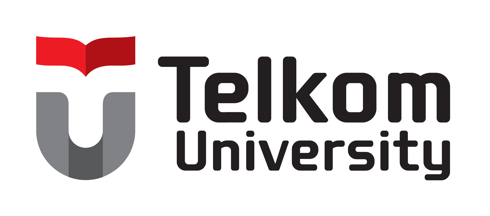

# STAS RG Generator

<p align="center">
  
  &nbsp;&nbsp;&nbsp;&nbsp;
  
</p>

<p align="center">
  <strong>Platform Otomasi, Manajemen & Standardisasi Dokumen Riset STAS RG</strong><br>
  <em>Center of Excellence Sustainable Technology and Applied Sciences Research Group (CoE STAS-RG) – Telkom University</em>
</p>

<p align="center">
  
  
  
  
  
  
</p>

---

## 📌 Ringkasan Proyek (Overview)

**STAS RG Generator** adalah platform web terpadu yang dirancang khusus untuk mengelola repositori hasil penelitian, mengotomasi pembuatan dokumen publikasi/flyer terstandarisasi, dan menyajikan showcase riset publik di lingkungan kelompok riset **Center of Excellence Sustainable Technology and Applied Sciences Research Group (CoE STAS-RG)**, Fakultas Ilmu Terapan, Telkom University.

Platform ini mengintegrasikan alur kerja riset mulai dari pencatatan data dan inovasi riset, media visual, logo kolaborator, hingga ekspor dokumen PDF berkualitas cetak dengan QR Code otomatis yang dapat diakses publik.

---

## ✨ Fitur & Modul Utama (Key Features)

### 1. 🌐 Landing Page & Showcase Publik
- **Hero Metrics & Live Registry**: Tampilan metrik real-time jumlah riset terdaftar, proyek terpublikasi, variasi kategori, dan jumlah peneliti yang terlibat.
- **Interactive Research Showcase**: Katalog riset publik interaktif dengan filter kategori instan, pencarian cepat, kartu proyek visual, serta tautan langsung ke detail dan unduhan PDF.
- **Halaman Detail Riset Publik (`/showcase/{slug}` & `/riset/{slug}`)**:
  - Tampilan komprehensif memuat latar belakang masalah, solusi inovatif, spesifikasi teknis, dan manfaat implementasi.
  - Galeri visual proyek dan logo mitra/kolaborator.
  - Generator **QR Code verifikasi interaktif** yang mengarah langsung ke URL publik riset.
  - Tombol unduh dokumen flyer PDF resmi secara instan.
- **Halaman Legalitas & Tata Kelola**:
  - **Kebijakan Privasi (`/privacy`)**: Kebijakan retensi data riset, enkripsi SSO, dan perlindungan privasi peneliti.
  - **Ketentuan Riset (`/terms`)**: Regulasi hak kekayaan intelektual (HKI), integritas akademik, dan standar templating CoE STAS-RG.

### 2. 🎨 Contemporary SaaS Design System (Strict Zero Shadows)
- **Strict Zero Shadows**: Estetika modern tanpa bayangan (`box-shadow: none !important`), mengedepankan hierarki kartu bersudut lengkung 24px (`rounded-3xl`), border presisi 1px (`border-zinc-200` / `border-zinc-800`), dan palet warna netral minimalis dengan aksen hijau emerald.
- **Vektor Presisi & Tipografi Editorial**: Ikon vektor SVG profesional menggunakan **Lucide React** dan tipografi modern **Plus Jakarta Sans**.
- **Dark Mode & Light Mode**: Transisi tema mulus dengan deteksi preferensi sistem otomatis (`prefers-color-scheme`) dan tersimpan di `localStorage`.
- **Multi-Bahasa (i18n)**: Penggantian bahasa instan antara **Bahasa Indonesia (ID)** dan **English (EN)** dengan flag toggle yang bersih.
- **Centered Frosted Glass Navigation**: Navigasi tengah bergaya *frosted pill* dengan *Active ScrollSpy* dinamis.

### 3. 🔐 Autentikasi Modern & Keamanan Berlapis
- **Multi-Metode Login**:
  - Autentikasi standar Email & Password terproteksi *rate limiter*.
  - **Google OAuth 2.0 Single Sign-On (SSO)** via Laravel Socialite.
  - **Passkey / Biometric WebAuthn**: Login tanpa password menggunakan sidik jari (Fingerprint), TouchID, FaceID, atau Windows Hello.
- **Alur Persetujuan Pengguna (User Approval Workflow)**:
  - Pendaftaran akun baru diverifikasi terlebih dahulu oleh administrator melalui middleware `approved` sebelum diberikan akses ke dashboard.
- **Pemulihan Akun dengan OTP Email**:
  - Mekanisme Reset Password aman menggunakan 6-digit One-Time Password (OTP) via Mailpit/SMTP.

### 4. 📊 Dashboard Admin & Manajemen Proyek Riset
- **Ringkasan Analitik**: Pantauan status proyek (Draft vs Published), metrik statistik, dan log aktivitas terbaru.
- **Formulir Proyek dengan Real-Time Live Preview**:
  - Formulir dinamis dilengkapi fitur *split live preview* (`ProjectPreview.jsx`) untuk melihat hasil flyer sebelum disimpan.
  - **Rich Text Editor** kustom untuk formulasi uraian masalah, solusi, dan deskripsi teknis.
  - Pengunggahan gambar utama (*Main Image*) dan logo mitra (*Partner Logo*).
  - Generate otomatis tautan slug SEO-friendly dan QR Code publik.
  - Fitur **Duplikasi Proyek (One-Click Clone)** untuk mempercepat input riset serupa.
  - Kontrol status publikasi langsung (*Draft / Published*).

### 5. 📄 Generator Dokumen PDF Terstandarisasi
- **Flyer Riset Standar CoE STAS-RG**: Layout A4 resmi yang terstruktur untuk kebutuhan pameran, hibah, arsip, dan diseminasi hasil penelitian.
- **Ekspor Dokumen Beresolusi Tinggi**: Ditenagai oleh **Laravel DomPDF** (`barryvdh/laravel-dompdf`) dengan integrasi logo institusi, barcode/QR Code tersemat, spesifikasi, dan ringkasan eksekutif.
- **Akses Unduhan Fleksibel**: Dapat diunduh oleh administrator melalui dashboard maupun oleh publik via halaman detail riset.

### 6. 👥 Manajemen Pengguna & Tim Peneliti
- Daftar seluruh peneliti dan pengguna terdaftar.
- Fitur verifikasi persetujuan (*Approve*) atau penolakan (*Reject*) akun pendaftar baru.
- Kontrol status akun (*Active / Suspended*), pengaturan hak akses, dan penghapusan pengguna.

### 7. ⚙️ Pengaturan Akun & Pemeliharaan Sistem
- **Manajemen Profil**: Pembaruan nama, email, dan unggah/hapus avatar profil.
- **Manajemen Kredensial Passkey**: Pendaftaran dan penghapusan perangkat biometrik WebAuthn.
- **Utilitas Pemeliharaan Sistem**:
  - Pembersihan Cache Aplikasi (*Clear Application Cache*).
  - Optimasi Konfigurasi & Route (*System Optimize*).
  - Pengalihan Mode Pemeliharaan (*Maintenance Mode Toggle*).

---

## 🛠️ Tech Stack & Arsitektur

| Layer | Teknologi / Library | Keterangan |
| :--- | :--- | :--- |
| **Backend Framework** | [Laravel 12.x](https://laravel.com) | PHP 8.3+ Framework |
| **Frontend Framework** | [React 19.x](https://react.dev) | Modern Component-Based UI |
| **SPA Bridge** | [Inertia.js v3](https://inertiajs.com) | Client-side routing tanpa REST API overhead |
| **Build Tool & Bundler**| [Vite 8.x](https://vitejs.dev) | Hot Module Replacement (HMR) berkecepatan tinggi |
| **CSS & Styling** | [Tailwind CSS v4](https://tailwindcss.com) | Utility-first CSS dengan aturan Strict Zero Shadows |
| **Animasi** | [Framer Motion](https://www.framer.com/motion/) | Transisi UI & mikro-animasi dinamis |
| **Iconography** | [Lucide React](https://lucide.dev) | Ikon vektor presisi dan konsisten |
| **PDF Generation** | [Laravel DomPDF](https://github.com/barryvdh/laravel-dompdf) | Render dokumen flyer PDF berbasis template Blade |
| **QR Code Engine** | SimpleSoftwareIO QrCode & QRCode.react | Pembuatan QR Code dinamis server-side & client-side |
| **Autentikasi Eksternal**| Laravel Socialite & WebAuthn | Google OAuth SSO & Biometric Passkey |
| **Database** | SQLite / MySQL / PostgreSQL | Relational Database Management |

---

## 🚀 Panduan Memulai (Installation & Setup)

### 1. Prasyarat Sistem
Pastikan perangkat Anda telah memiliki:
- **PHP** >= 8.3 (Disarankan ekstensi `pdo`, `mbstring`, `openssl`, `gd`/`imagick`, `fileinfo` aktif)
- **Composer** >= 2.x
- **Node.js** >= 20.x & **npm**

### 2. Kloning & Instalasi Dependensi
```bash
# Masuk ke direktori kerja
cd stasrg-generator

# Instal dependensi backend (Composer)
composer install

# Instal dependensi frontend (NPM)
npm install
```

### 3. Konfigurasi Environment (`.env`)
```bash
# Salin template environment jika belum ada
cp .env.example .env

# Generate Application Encryption Key
php artisan key:generate
```

Sesuaikan konfigurasi database dan mailer pada file `.env`:
```ini
APP_NAME="STAS RG Generator"
APP_URL=http://localhost:8000

DB_CONNECTION=sqlite
# atau DB_CONNECTION=mysql / pgsql sesuai server database Anda

# Konfigurasi Mailpit / Mailer untuk OTP Reset Password
MAIL_MAILER=smtp
MAIL_HOST=127.0.0.1
MAIL_PORT=1025
MAIL_USERNAME=null
MAIL_PASSWORD=null
MAIL_ENCRYPTION=null
MAIL_FROM_ADDRESS="no-reply@stasrg.telkomuniversity.ac.id"
MAIL_FROM_NAME="${APP_NAME}"

# Konfigurasi Google OAuth SSO (Opsional)
GOOGLE_CLIENT_ID=your-google-client-id
GOOGLE_CLIENT_SECRET=your-google-client-secret
GOOGLE_REDIRECT_URI="${APP_URL}/auth/google/callback"
```

### 4. Migrasi Database & Storage Symlink
```bash
# Jalankan migrasi database
php artisan migrate

# Buat symbolic link untuk folder storage publik (gambar riset, avatar, dll.)
php artisan storage:link
```

*(Opsional)* Anda dapat menjalankan seeder jika tersedia:
```bash
php artisan db:seed
```

### 5. Menjalankan Server Pengembangan
Jalankan backend Laravel dan frontend Vite secara bersamaan:

```bash
# Menggunakan script komposer bawaan (menjalankan Laravel dev server & Vite)
composer run dev
```

Atau jalankan di dua terminal terpisah:
```bash
# Terminal 1: Backend Laravel
php artisan serve

# Terminal 2: Frontend Vite HMR
npm run dev
```

Buka peramban di alamat: **`http://localhost:8000`**

### 6. Kompilasi Produksi (Production Build)
Untuk keperluan deployment pada server produksi:
```bash
npm run build
php artisan optimize
```

---

## 📂 Struktur Direktori Proyek

```
stasrg-generator/
├── app/
│   ├── Http/
│   │   ├── Controllers/
│   │   │   ├── Auth/                             # Controller Autentikasi (Login, Google, Passkey, OTP)
│   │   │   ├── DashboardController.php           # Controller Admin Dashboard
│   │   │   ├── ProjectController.php             # Controller CRUD Proyek, Ekspor PDF & Showcase
│   │   │   ├── SettingsController.php            # Controller Profil, Passkey & Maintenance
│   │   │   └── UserController.php                # Controller Manajemen User & Approval
│   │   └── Middleware/
│   │       ├── EnsureUserIsApproved.php          # Middleware Proteksi Persetujuan Akun
│   │       └── HandleInertiaRequests.php         # Shared Data Inertia (Auth, Flash, dll)
│   └── Models/
│       ├── Passkey.php                           # Model Kredensial Passkey WebAuthn
│       ├── Project.php                           # Model Entitas Proyek Riset
│       └── User.php                              # Model Pengguna & Peneliti
├── database/
│   ├── factories/                                # Model Factories untuk Testing
│   ├── migrations/                               # Database Schema Migrations
│   └── seeders/                                  # Database Seeders
├── public/
│   ├── assets/img/                               # Aset Statis (Logo STAS RG & Telkom University)
│   └── storage/                                  # Symlink ke storage/app/public
├── resources/
│   ├── css/
│   │   └── app.css                               # Tailwind CSS v4 setup & Zero-Shadow Utilities
│   ├── js/
│   │   ├── Components/
│   │   │   ├── Admin/                            # Komponen Dashboard (Sidebar, Header, Preview, Editor)
│   │   │   ├── AboutSection.jsx                  # Seksi Tentang Platform
│   │   │   ├── AlertModal.jsx                    # Modal Dialog Notifikasi & Konfirmasi
│   │   │   ├── BiometricModal.jsx                # Modal Verifikasi & Registrasi Passkey
│   │   │   ├── Footer.jsx                        # 3-Column Editorial Footer + Lokasi Lab
│   │   │   ├── HeroSection.jsx                   # Hero Section + Real-Time Registry Metrics
│   │   │   ├── HowItWorksSection.jsx             # Seksi Alur Protokol 3 Langkah
│   │   │   ├── InternalNoteBanner.jsx            # Banner Keamanan & SSO Portal
│   │   │   ├── Navbar.jsx                        # Navigasi Frosted Glass + Switcher Bahasa & Tema
│   │   │   ├── PrinciplesSection.jsx             # Seksi Prinsip Operasional
│   │   │   └── ProjectShowcaseSection.jsx        # Katalog Showcase Riset Interaktif
│   │   ├── Context/
│   │   │   └── AppContext.jsx                    # State Provider untuk Tema & Bahasa (i18n)
│   │   ├── Layouts/
│   │   │   └── AdminLayout.jsx                   # Shell Layout Admin Panel
│   │   ├── Pages/
│   │   │   ├── Admin/                            # Halaman Dashboard, Proyek, Pengguna, Pengaturan
│   │   │   ├── Auth/                             # Halaman Login, Register, Forgot & Reset Password
│   │   │   ├── Public/                           # Halaman Detail Riset Publik (Showcase)
│   │   │   ├── Privacy.jsx                       # Halaman Kebijakan Privasi
│   │   │   ├── Terms.jsx                         # Halaman Ketentuan Riset
│   │   │   └── Welcome.jsx                       # Landing Page Utama
│   │   └── translations/
│   │       └── translations.js                   # Kamus Bahasa Indonesia & Inggris
│   └── views/
│       ├── app.blade.php                         # Root HTML Blade Shell
│       ├── emails/                               # Template Email OTP
│       └── pdf/                                  # Template Blade untuk Dokumen PDF Flyer Riset
├── routes/
│   ├── web.php                                   # Rute Web & Endpoint Aplikasi
│   └── console.php                               # Artisan CLI Commands
└── vite.config.js                                # Konfigurasi Vite, React & Tailwind CSS
```

---

## 🧪 Pengujian & Standar Kualitas Kode

Proyek ini dilengkapi dengan suite pengujian otomatis (Unit & Feature Tests) dan linter standar Laravel:

```bash
# Menjalankan pengujian otomatis menggunakan PHPUnit
php artisan test

# Menjalankan Laravel Pint untuk memastikan standar format kode PSR-12
vendor/bin/pint --format agent
```

---

## 🔒 Lisensi & Hak Cipta

© **Center of Excellence Sustainable Technology and Applied Sciences Research Group (CoE STAS-RG)**<br>
Fakultas Ilmu Terapan, Telkom University. Seluruh Hak Cipta Dilindungi.

Akses sistem ini terbatas khusus untuk civitas akademika, peneliti, dan staf yang berwenang di lingkungan Telkom University.
